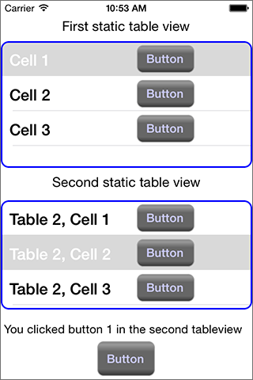

test
====

A demo of using multiple static table views in iOS 6.

This project shows how to set up mutiple `UITableViewController`s on a single screen. It uses a parent view controller with container views and a pair of `UITableViewController`s as child view controllers. The parent view controller has "container" views in it, that link to the `UITableViewController`s using embed segues.

The screen looks like this:

-><-

The project defines a protocol that the parent view controller uses to communicate with the child `UITableViewController`s, and a second protocol that the children use to notify the parent when the user makes a selection or clicks a button.

